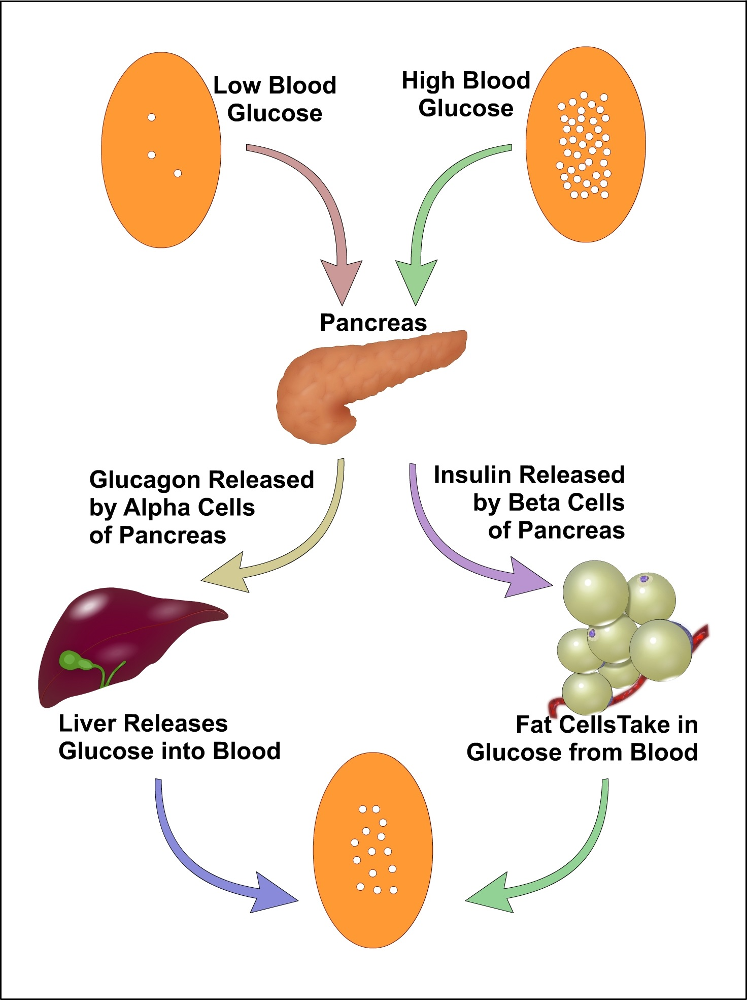

### Theory

Glucose is a simple sugar which is a permanent and immediate primary source of energy to all of the cells in our body. The glucose in blood is obtained from the food that you eat. This glucose gets absorbed by intestines and distributed to all of the cells in body through bloodstream and breaks it down for energy.

&nbsp;

Body tries to maintain a constant supply of glucose for your cells by maintaining a constant blood glucose concentration. The concentration of glucose in blood, expressed in mg/dl, is defined by the term glycemia. The value of blood sugar in humans generally ranges from 70 - 100 mg/dl. Blood sugar levels are regulated by the hormones insulin and glucagon which act antagonistically. These two hormones are secreted by the islet cells of the pancreas, and thus are referred to as pancreatic endocrine hormones. When the blood glucose levels are high, insulin hormone secreted which causing liver to convert more glucose molecules into glycogen and when the blood glucose levels are low glucagon secreted and act on liver cells to promote the breakdown of glycogen to glucose and increases the blood glucose concentrations. Essentially blood glucose levels determine the time of secretion of these hormones. 

&nbsp;

The blood glucose level is easily changed under the influence of some external and internal factors such as body composition, age, physical activity and sex. Diabetes is a disease related by the abnormal metabolism of blood sugar and defective insulin production. So blood sugar levels are an important parameter for the study of diabetes. The level of glucose circulating in blood at a given time is called as blood glucose level. The blood glucose level varies at different time on various part of the day. Hypoglycemia is a possible side effect of diabetes medications in which blood glucose level drops below 70mg/dl. In people with diabetes, the body doesn't produce enough insulin or respond to insulin properly. The result is that sugar builds up in the blood stream, damaging the body's organs, blood vessels and nerves. This condition in which too much sugar in the blood stream is called hyperglycemia.

&nbsp;

Fig (1): Homeostasis of blood glucose

 
&nbsp;

The blood glucose analysis is ordered to measure the amount of blood at the time of sample collection. It is used to detect both hyperglycemia and hypoglycemia and via helping the diagnosis of diabetes. An ideal blood glucose estimation method should determine only glucose. It is adaptable for both macro- and semi micro- techniques. Reagents are relatively inexpensive and the method should require a minimum of time, techniques and apparatus, be accurate and yield reproducible results. Glucose oxidase is an enzyme highly specific for glucose and is not react with blood saccharides. So it has been employed for the estimation of blood glucose.

 

 
&nbsp;
### Principle:
 
&nbsp;

Glucose oxidase is an enzyme extracted from the growth medium of Aspergillus niger. Glucose oxidase catalyse the oxidation of Beta D- glucose present in the plasma to D glucono -1 ,5 - lactone with the formation of hydrogen peroxide; the lactone is then slowly hydrolysed to D-gluconic acid. The hydrogen peroxide produced is then broken down to oxygen and water by a peroxidase enzyme. Oxygen then react with an oxygen acceptor such as ortho toluidine which itself converted to a coloured compound, the amount of which can be measured colorimetrically. 